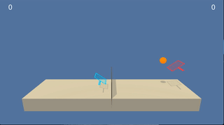
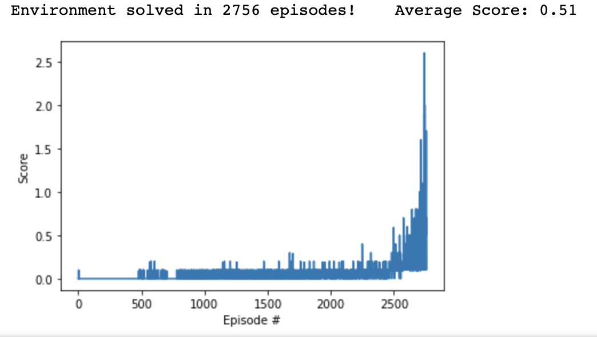

# Project Overview
This is how this particular trained agent looks like:

#### Learning algorithm

The chosen algorithm for solving the project is Deep Deterministic Policy Gradient (DDPG).

Tha algorithm is included in the Actor-Critic Methods, although the Critic is not really calculating a baseline, and more it is an estimation of Q value maximizer.
The algorithm is considered an analogue of DQN for continuous action spaces.
Differently from other Actor-Critic methods, DDPG is using an experience replay memory. 

Each network, actor and critic have two versions, a local and a target one. 
The trickiest thing is to remember when to use local or target copies of the network.
It is easy to remember the following two things: 

1. Backprop only through local copies  

2. Use local copies for current states and actions and target copies for next states and next actions.

The intuition of the algorithm is the following:

1. Use the local copy of the actor to predict what actions to take in the current state.

2. Compute local actor network loss as the negative sign of the estimated Q value of taking predicted actions from point 1. We use the loss to back prop through the local actor network.

3. Predict the actions that agent should take in the next_states. For this we use the target actor network. 

4. Estimate what would be the max Q values in case agent takes predicted next actions to next states. 
We use these values discounted together with rewards to calculate the target values for current state.

5. Compute the critic loss as MSE between what we calculated at 4 and what the local critic network is estimating for current states and predicted actions at 1.
We use this to train the local critic. What is extremely important here is to mention that we are clipping critic's gradients:
`        torch.nn.utils.clip_grad_norm(self.critic_local.parameters(), 1)`

6. At the end, we do a soft update of both target networks.

7. Repeat through steps 1-6 until we reach our desirable result.

#### Hyperparameters

We have the following hyperparameters we need to work with:
* Replay buffer size, `BUFFER_SIZE` represent the "Memory" we want our agent to have. Ideally we would like as much memory as we can get, in the current application we have 1e6. 
* Learning mini batch size, `BATCH_SIZE` is the amount of samples we will extract from "Memory" in order to learn based on. In my case it is 256. Batch size is recommended a power of 2 number.
* The discount factor, `GAMMA` is mainly the discount that we apply on the next state and its best action pair value, the estimated max Q by target critic. We could play with this factor in order to balance the long and short term agent objectives. 0.95 gave better results than 0.99, so the former was chosen.
* The update rate, `TAU`, one should think about this as a learning rate for weights from local network to target network. 0.005 as TAU was chosen. A lower tau gave slightly worse results.
* The learning rate, `LR`, represents the learning rate of the networks. The actual LR is 0.001 for Actor network and 0.0001 for Critic.  A regularisation term L2 was also tried, but the learning was significantly slower, so that I left the default value = 0.
* ONU noise parameters that are taking care of its decay are `EPS_DECAY`, `EPS_START` and `EPS_END`. The intuition is the same as for epsilon-greedy policies, to balance the exploration and exploitation. Something to mention is that the ONU class itself has an internal
* When we decide to update the  networks, we use the `UPDATE_EVERY` and `UPDATE_TIMES` parameters, that mainly indicate how often, and how many times we need to update the agent local networks.

#### Model architectures for NN
A simple NN architecture was chosen for both actor and critic networks consisting of two hidden layers, first one having 128 units and the 2nd 128 units respectively.
Activation functions for all hidden layers are ReLu. The last activation function for Actor is tanh, because we want actions to fall into the [-1,1] interval. For Critic, no activation function was used in the end, because we want just a numerical value.
Adam optimizer was used for learning.

### Plot of Rewards

 

The environment was solved in 2756 episodes

### Ideas for Future Work
The project was solved my thinking of the two agents as one agent and training one agent but with double the experience he would get.
The trained agent takes as input only his space and the Critic is also estimating the max Q function relying on a subset of the state, not the full one.

The more appropriate approach is to change the algorithm to take into consideration the whole state and all the actions when estimating the max Q function.
Also, another way would be to decouple the two agents and train them independently, while their Critics are using the full actions and states.

